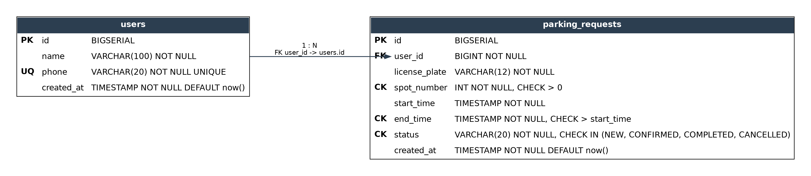

# Парковочная система

**Информационная система учёта заявок на парковку: консольное приложение с постепенным развитием в десктоп-клиент, REST API и мобильное приложение.**


> **Проект находится в активной разработке.** Реализована первая контрольная работа (КР1), консольное Java-приложение. Следующие этапы (КР2, КР3, КР4) пока не начаты.

Парковочная система: сквозной учебный проект, который поэтапно вырастает из консольного приложения в полноценную систему с несколькими клиентами. Пользователи создают заявки на парковочные места, привязанные к владельцам, а система следит за соблюдением бизнес-правил: занятостью мест, корректностью дат и допустимыми переходами статусов заявки.

*Семестровый проект, РТУ МИРЭА.*

## Проблема

Учёт заявок на парковочные места вручную приводит к двойным бронированиям одного места на пересекающееся время и потере истории обращений владельцев. Система формализует заявку как отдельную сущность с жизненным циклом статусов и проверяет бизнес-правила при создании, изменении и смене статуса.

## Функционал

### Реализовано (КР1)

- CRUD владельцев автомобилей и заявок на парковку через JDBC. Используется только `PreparedStatement`, try-with-resources, без конкатенации SQL.
- Бизнес-правила заявки:
  - обязательный и непустой гос. номер;
  - владелец с указанным ID должен существовать;
  - дата и время окончания строго позже даты и времени начала;
  - запрет двух заявок на одно место с пересекающимися интервалами (учитываются только активные статусы `NEW` и `CONFIRMED`);
  - допустимые переходы статуса заявки (`NEW → CONFIRMED/CANCELLED`, `CONFIRMED → COMPLETED/CANCELLED`); `COMPLETED` и `CANCELLED` являются конечными статусами.
- Правила владельца: имя и телефон обязательны, телефон уникален, владельца с заявками удалить нельзя.
- Поиск заявок по гос. номеру и по имени владельца (по фрагменту, без учёта регистра).
- Фильтрация заявок по статусу и по диапазону дат.
- Сортировка заявок по времени начала и по дате создания.
- Статистика (6 показателей): владельцы, заявки, активные, завершённые, отменённые, занятые места прямо сейчас.
- Экспорт данных в `.xlsx` через Apache POI: листы «Владельцы» и «Заявки».
- Вывод обеих таблиц базы данных из меню.
- Устойчивость к некорректному вводу: текст вместо числа, несуществующий ID, битая дата, неизвестный статус.
- Схема БД, тестовые данные и ER-диаграмма.

### Дальше по плану (следующие КР)

- **КР2**: десктоп-клиент на JavaFX поверх той же бизнес-логики.
- **КР3**: REST API на Spring и вынос бизнес-логики за HTTP-интерфейс.
- **КР4**: мобильное приложение под Android.

## Технологический стек

- **Java 21, Maven**: язык и сборка backend-части.
- **JDBC (`PreparedStatement`, try-with-resources)**: доступ к базе данных без ORM, осознанное требование КР1.
- **PostgreSQL**: хранение владельцев и заявок на парковку.
- **Apache POI**: экспорт данных в Excel.
- **Docker Compose**: локальный запуск PostgreSQL с тестовыми данными из `sql/init.sql`.
- **JavaFX** *(план, КР2)*, **Spring, REST** *(план, КР3)*, **Android** *(план, КР4)*: следующие этапы проекта поверх текущей модели и бизнес-логики.

## Архитектура

Консольный клиент обращается к сервисному слою с бизнес-правилами, а тот обращается к репозиториям, работающим с PostgreSQL напрямую через JDBC.

```text
ConsoleUI (меню, ввод/вывод, обработка некорректных данных)
       |
ParkingRequestService / UserService (валидация и бизнес-правила)
       |
ParkingRequestRepository / UserRepository (JDBC, PreparedStatement)
       |
PostgreSQL
```

## Модель данных

Две связанные сущности: **User** (владелец автомобиля) и **ParkingRequest** (заявка на парковку, ссылается на владельца по `user_id`) со статусом на основе enum `RequestStatus`.



## Файловая архитектура

```text
.
├── backend/                          # Java-проект (Maven) для КР1, КР2 и КР3
│   ├── src/main/java/ru/mirea/project/
│   │   ├── model/                    # Сущности и enum: ParkingRequest, User, RequestStatus
│   │   ├── repository/               # JDBC-доступ к данным (CrudRepository и реализации)
│   │   ├── service/                  # Бизнес-правила и валидация
│   │   ├── exception/                # Доменные исключения (Business, DataAccess, EntityNotFound)
│   │   ├── ui/                       # Консольный интерфейс (ConsoleUI)
│   │   └── util/                     # DatabaseManager, ExcelExporter
│   └── pom.xml
├── sql/init.sql                       # Схема базы данных и тестовые данные
├── docker/docker-compose.yml          # PostgreSQL в контейнере
├── mobile/                            # Заготовка под Android-клиент (КР4)
└── docs/                              # Требования к КР, ER-диаграмма, конвенция коммитов
```

## Установка и запуск

Для запуска нужны JDK 21+, Maven, Docker и Docker Compose.

Поднимите PostgreSQL в контейнере:

```bash
docker compose -f docker/docker-compose.yml up -d
```

База будет доступна на `localhost:5432` (база `project_db`, пользователь `project_user`) со схемой и тестовыми данными из `sql/init.sql`. Параметры подключения лежат в `backend/src/main/resources/db.properties`.

Соберите и запустите консольное приложение:

```bash
cd backend
mvn compile exec:java
```

Остановить контейнер с базой:

```bash
docker compose -f docker/docker-compose.yml down
```

### Пересоздать базу с нуля

Скрипт `sql/init.sql` выполняется только при первом создании тома с данными, поэтому для возврата к исходным тестовым данным том нужно удалить:

```bash
docker compose -f docker/docker-compose.yml down -v
docker compose -f docker/docker-compose.yml up -d
```

### Если что-то не работает

- Ошибка подключения к базе: убедитесь, что контейнер запущен (`docker ps`) и порт 5432 не занят другим PostgreSQL. Если занят, остановите локальный сервер или измените порт в `docker/docker-compose.yml` и в `db.properties`.
- `mvn` не находит Java 21: проверьте `java -version` и переменную `JAVA_HOME`.

## Пример использования

После запуска откроется главное меню, все пункты работают.

1. **Владельцы автомобилей**: создайте владельца, указав имя и уникальный телефон, найдите, измените или удалите его.
2. **Заявки на парковку**: создайте заявку (ID владельца, гос. номер, место, период). При нарушении бизнес-правил (несуществующий владелец, занятое место, некорректные даты) приложение выведет понятное сообщение и не создаст запись. Статус меняется отдельным пунктом, недопустимый переход (например, из `COMPLETED`) будет отклонён.
3. **Поиск**: по фрагменту гос. номера или имени владельца (с его заявками).
4. **Фильтрация**: по статусу, по диапазону дат, сортировка по времени начала или дате создания.
5. **Статистика**: шесть показателей одним экраном.
6. **Экспорт данных**: файл `parking_export.xlsx` с листами «Владельцы» и «Заявки» сохраняется в папке, из которой запущено приложение, путь выводится на экран.
7. **Вывести таблицы базы данных**: содержимое таблиц `users` и `parking_requests` в виде таблиц с заголовками.

## Итоги

Реализована КР1: консольное приложение с двумя связанными сущностями, бизнес-правилами, поиском, фильтрацией, сортировкой, статистикой и экспортом в Excel. КР2, КР3 и КР4 являются следующими этапами того же сквозного проекта и пока не начаты.

## Команда

Учебный проект, разрабатывается командой студентов в рамках дисциплины в РТУ МИРЭА.

## Лицензия

Код распространяется по лицензии [MIT](LICENSE).
